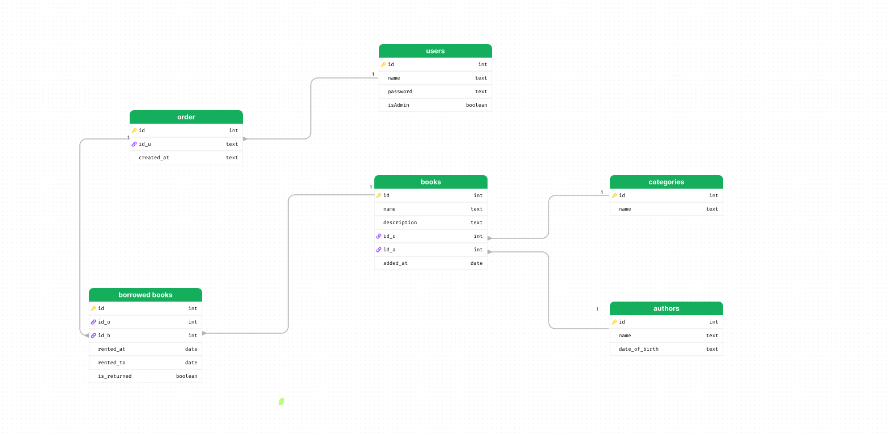
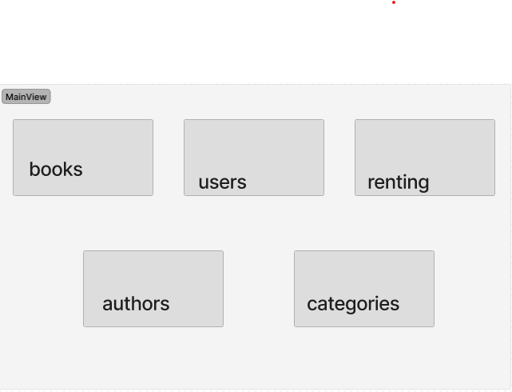
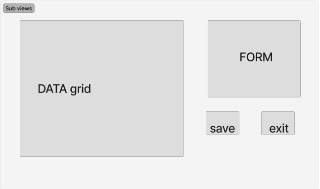
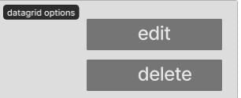

<h1>Aplikacja biblioteka</h1>
<h2>UWAGA Przed uruchomieniem aplikacji trzeba zaimportowac baze za pomocą plic schema.dacpac</h2>
<h2>Diagram erd</h2>

<h2>Widok główny</h2>
<h3>Składa się on z 5 funkcjonalnych przycisków</h3>
<ol>
    <li>Otwiera panel z książkami</li>
    <li>Otwiera panel z użytkownikami</li>
    <li>Otwiera panel do wypożyczania/oddawania książek</li>
    <li>Otwiera panel z autorami/li>
    <li>Otwiera panel z kategoriami</li>
</ol> 

<h2>Panele aplikacji</h2>
<h3>Każdy panel aplikacji składa się z :</h3>
<ul>
    <li>Datagrida na dane</li>
    <li>Formularza do wypełnienia odpowiedniego datagrida</li>
    <li>Przycisku do zapisu/edycji rzeczy w datagridzie</li>
    <li>Przycisku do powrotu do menu głównego</li>    
</ul>

<h2>Funkcjonalności datagrida</h2>
<h3>Po przycisnieciu prawym przyciskiem na wiersz otwiera się okno umożliwiające edycje lub usunięcie wiersza</h3>
<